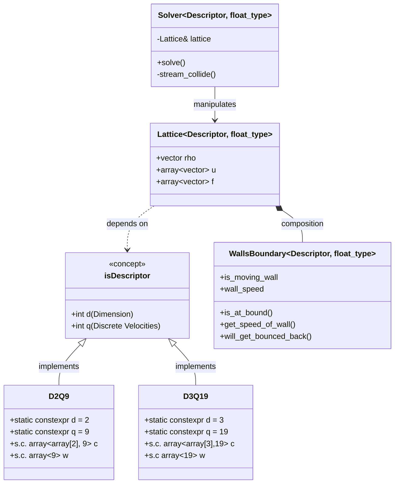

# LBM-1-LBM: High-Performance Lattice Boltzmann Solver 

A parallel C++ implementation of the Lattice Boltzmann Method (LBM) for computational fluid dynamics (CFD).

## Overview

This project provides a flexible framework for simulating fluid flows using the discrete Boltzmann equation. It is designed with **High Performance Computing (HPC)** principles in mind, utilizing modern C++ features (e.g. concepts, variadic templates), cache-friendly data structures, and shared-memory parallelization (OpenMP).

The solver currently supports **Lid-Driven Cavity** flow benchmarks but is structured to be extensible for other geometries and boundary conditions. 

## Key Features

* **Lattice Models:** Support for **D2Q9** (2D) and **D3Q19** (3D) lattice discrete velocity models.
* **HPC Optimizations:**
    * **Structure of Arrays (SoA)** memory layout for efficient vectorization (SIMD) and cache usage.
    * **OpenMP** parallelization for multi-core execution.
    * **Template classes** for maximum generality
* **Numerical Methods:**
    * **BGK** (Bhatnagar-Gross-Krook) collision operator.
    * **Bounce-Back** boundary conditions for no-slip walls.
    * **Moving Wall** boundary conditions (Lid-Driven).
* **Visualization:** **VTK (.vtk)** output support, fully compatible with [ParaView](https://www.paraview.org/).
* **Validation:** Includes tests against the **Ghia et al. (1982)** benchmark data.

## Project Structure

``` text
lbm-1-lbm/
├── include/
│   └── LBM/             # Header-only template library (Lattice, Solver, Boundary, Descriptor, LBM)
├── src/
│   └── LBM/             # Header implementation 
|   └── main.cpp         # Main simulation entry point
├── test/
│   ├── lattice_test.cpp # Unit tests for core data structures (Catch2)
│   └── validation_ghia.cpp # Physics validation (Re=100)
├── CMakeLists.txt       # CMake build configuration
└── README.md
```

## Software Architecture

The project is designed around three main components, leveraging **C++20 Concepts** and **Static Polymorphism**.

### Class Diagram



### Core Components

#### 1. Descriptors (`D2Q9`, `D3Q19`)
Defines the discrete velocity set ($\vec{c}_i$) and weights ($w_i$) at **compile-time**.
- Uses `constexpr` arrays to allow loop unrolling and aggressive compiler optimizations.
- Allow the solver to switch between 2D and 3D logic without runtime overhead.

#### 2. `WallsBoundary` (Geometry Handler)
Handles the geometric logic of the domain boundaries.
- **Responsibility:** Determines if a specific cell index corresponds to a physical wall and handles boundary properties (e.g., identifying the Moving Lid vs. Static Walls).

#### 3. `Lattice` (Data Container)
The owner of the simulation data and grid topology.
- **Data Layout:** Implements a **Structure of Arrays (SoA)** layout for macroscopic fields (`u`) and distributions (`f`). This layout is chosen to maximize cache locality and enable auto-vectorization (SIMD) on modern CPUs.
- **Composition:** It owns an instance of `WallsBoundary` to delegate geometric checks while maintaining a unified interface for the solver.

#### 4. `Solver` (Algorithm)
Implements the time-evolution loop of the LBM equation.
- **Fused Kernel:** Performs the *Stream* and *Collide* steps in a single pass over the grid. This maximizes arithmetic intensity and reduces memory bandwidth pressure compared to separate passes.
- **Parallelism:** The main loop is fully parallelized using **OpenMP** with a static scheduling strategy.

## Building
- C++20 or later compiler
- CMake 3.28+
- Git

### Building Instructions
``` bash
cd lbm-1-lbm
mkdir -p build
cd build
cmake .. -DBUILD_TESTS=ON
make
```

## Usage
### Testing
We use [Catch2](https://github.com/catchorg/Catch2) for unit and integration testing.
To run the tests:
``` bash
cd build
./run_tests
```
#### Benchmark: Ghia et al. (1982)

The project includes a specific validation test that compares the computed velocity profiles (u-velocity along vertical centerline, v-velocity along horizontal centerline) against the tabulated data from the standard reference.

### Standard usage
``` bash
cd build
./LBM
```
TODO

## Visualization
TODO

## Acknowledgments
This project was developed for the **Advanced Methods for Scientific Computing** course at **Politecnico di Milano** (A.Y. 2025-2026).

* **[Prof. Luca Formaggia](https://github.com/lformaggia)** - *Course Instructor*
* **[Dr. Paolo Joseph Baioni](https://github.com/pjbaioni)** - *Teaching Assistant*
* **[Dr. Marco Scarpelli](https://github.com/ScarpMarc)** - *Teaching Assistant*

## Authors
* **[Giovanni Carpenedo](https://github.com/gcarpenedo)**
* **[Daniele Confalonieri](https://github.com/DanieleConfalonieri)**
* **[Cristiano Corona](https://github.com/CristianoCorona)**
* **[Simone Ferri](https://github.com/SimoFerri)**
* **[Federico Pizzolato](https://github.com/federico-pizz)**


